Data Exchange
===================================

Decision Model
~~~~~~~~~~~~~~~~~~~~~~~~~~~~~~~~~~~

How outside system access data on blockchain?
~~~~~~~~~~~~~~~~~~~~~~~~~~~~~~~~~~~~~~~~~~~~~~~

Pattern Features
------------------

**Pull-based Outbound Oracle** filters the blockchain data through oracle to make it available to the outside world. 
For example, off-chain components can query the on-chain information using ID through oracle, also called Reverse oracle in [13]. 
The off-chain user can query the required on-chain data flexibly, 
due to the  decoupling of off-chain data request and on-chain data retrieval [39], 
which brings better flexibility. However, the introduction of the oracle, 
which is responsible for interactions with the outside world, 
requires the transformation of the native system, 
causing system complexity and low portability. 
In [13], it is mentioned that It's not always possible to use blockchain in a non-intrusive way depending on the extensibility of the existing systems.

**Push-based Outbound Oracle**, also called Anti-Oracle in [5]. 
In this pattern, oracle listens for state or specific data changes on-chain to trigger off-chain activities or off-chain data storage. 
oracles will continuously listen to the on-chain event, 
so that the on-chain and off-chain data can always maintain a better consistency. 
The adjustment of the original system can be avoided because the blockchain event listener is an external component implemented in a client[5], 
and thus this pattern has better portability than Pull-based Outbound Oracle. 
However, it lacks flexibility compared to the Pull-based Outbound Oracle, 
which can only listen and trigger off-chain activities according to pre-defined events. 
And the failure of the listener will cause the suspension of the off-chain triggering mechanism[39], 
leading to the blocking of interaction between the on-chain and off-chain and reliability reduction. 

Communality
------------

- Both lead to performance degradation:
  
  -  In Pull-based Outbound Oracle, data provisioning is slow due to the need for the outside world to locate the requested information[39].
  
  -  In Push-based Outbound Oracle, the behavior is initiated by the blockchain, which has low performance because of its native mechanism, resulting in a large transaction delay, and unable to meet time-sensitive transactions[39].

- Both lead to better usability:
  
  - In Pull-based Outbound Oracle, the interface set by oracle to interact with the outside world is unified to query and filter blockchain data, which can decouple request and retrieval, and provide a common query method.
  
  - In Push-based Outbound Oracle blockchain-related businesses can be partially automated by off-chain listener and event trigger, as the case showed in [39]. 

How blockchain get data from outside system?
~~~~~~~~~~~~~~~~~~~~~~~~~~~~~~~~~~~~~~~~~~~~~~

Pattern Features
------------------

**Pull-based Inbound Oracle**. When the blockchain application requests an off-chain state, 
the oracle service collects state from off-chain components, 
and sends the results back to the blockchain via transaction.
The whole process is completely transparent and public, 
and the data on the chain will always be tracked, 
so it is easy to verify and check the status time, 
as the attribute: "transparency and traceability" mentioned in [39]. 
However, for the outside world, all information needs to be actively invoked by the blockchain, 
and the speed of accessing off-chain resources can lead to performance bottlenecks and low efficiency.

**Select-Storage** pattern solves the contradiction between the oracle's efficiency and cost through SVM(Support Vector Machine) classification for on-chain and off-chain data, 
and is the sub-pattern of Pull-based Inbound Oracle. 
In this pattern , the performance is significantly improved due to the introduction of the SVM model, 
which puts critical, multiple times reused data on chain, 
allowing for fast response to requests and improving the oracle's throughput.
Meanwhile, the caching strategy is dynamically set based on SVM model to balance the fast reusable on-chain data with the cost-saving off-chain data, 
which reduces the blockchain overhead. 
However, the combined use of on-chain and off-chain components and data analysis leads to high development complexity. 
And SVM model training time also consumes time and computational resources, 
making it difficult to quickly apply to various scenarios and poor portability. 
And security can be compromised because there is the possibility of information being tampered with because of the lack of encrypt and decrypt function.

**Bulletin Board** creates bulletin board contracts where users can post requests and answers, similar to public Q&A(Question and Answer) posts. 
This pattern is a sub-pattern of Pull-based Inbound Oracle. 
In Bulletin Board pattern, questions and answers are all conducted by users, 
which is similar to the P2P method. This method can solve more complex requests rather than simple oracle query data, 
and has better flexibility compared to other oracle based method. 
However, this approach is essentially a blockchain-based Q&A post, 
so it is impossible to obtain valid results timely, 
and the results will be more dependent on other users' answers.

**Push-based Inbound Oracle**. In this pattern, the oracle actively propagates off-chain information to the blockchain by monitoring off-chain state changes or periodically passing in data to smart contracts, 
and on-chain applications do not have to search and query off-chain data themselves[39], 
ensuring better performance and reliability.
However, the data pushed by oracle is not always deployed or triggered on the blockchain, 
making data provision completely dependent on off-chain applications[39]. 
This results in data not being fully inspected and verified by the blockchain nodes, 
which may trigger malicious behavior by adversaries.

Communality
------------

- Both lead to a decrease in credibility and security:
  
  -  These patterns focus on how to bring external trusted data into blockchain. However, all of these four patterns inevitably rely on external applications, and the way external data is introduced based on off-chain components can lead to centralization and reduction of credibility, which directly affects the internal blockchain system and thus poses a greater threat.  If the external data source is attacked or tampered with, it will lead to compromise of the on-chain data and blockchain applications as well, which will significantly increase the security risk. 
  
  -  [27] takes Ethereum as an example to show the contract code that implements this pattern, which points out that these oracles contradict the blockchain theorem of a decentralized network. And  [27_21, 27_22]  try to address this shortcoming by providing data with proof of authenticity. 

- All of the patterns have improved interoperability:
  
  - Although the purpose and method of communication with the outside world are varied in different patterns , they objectively provide methods and interact with off-chain components of the outside world , and improve the interoperability between on-chain and off-chain information.
  
  - In Push-based Outbound Oracle blockchain-related businesses can be partially automated by off-chain listener and event trigger, as the case showed in [39]. 