Data Migration
===================================

Decision Model
~~~~~~~~~~~~~~~~~~~~~~~~~~~~~~~~~~~

How to extract status information?
~~~~~~~~~~~~~~~~~~~~~~~~~~~~~~~~~~~~~~~~~~~~~~~

Pattern Features
------------------

**Snapshotting** can be used to access to blockchain information such as transactions, 
contract status and smart contracts at a specific time. In this pattern, 
each snapshot is created after reaching finality to preserve data consistency among different nodes of blockchain. 
Besides, this pattern can be used to create snapshots of any account status, 
transaction, or smart contract, resulting in better flexibility. 
However, latency is depended on the time blockchain reach finality, 
thus this pattern is suitable for blockchain without any external interaction for better performance. 

How to load status information?
~~~~~~~~~~~~~~~~~~~~~~~~~~~~~~~~~~~

Pattern Features
------------------

The **State Aggregation** pattern aggregates a group of states into one state (e.g., aggregate account assets to a single account). 
This method can reduce storage and computation costs of accounts and states after aggregation, 
and can effectively reduce migration overhead. 
In public blockchain, this pattern can reduce transaction fees, 
provided that the complexity and number of account aggregations are not too high. 
However, this pattern can only be applied to migration of simple states, 
that is, states can be simplified to the merging of several values, and is therefore less flexible. 
Thus, the pattern application is limited and therefore less flexible.

In **Token Burning** pattern, the account state is set to unavailable, 
the token is transferred to an unusable account, and the smart contract can call the self-destruct function. 
Because this pattern is based on PoB proof, token or states on blockchain can be burned for verification, 
which has broader application range and better flexibility. 
Besides, PoB can prevent the misuse of states and smart contracts, 
thus avoiding double-spending attacks and improving security. 
However, each transaction requires burning of token or states. 
And in public blockchain, the transaction fee is required for burning operation, 
resulting in larger overhead and to some extent wasted resources.

How to deliver status information?
~~~~~~~~~~~~~~~~~~~~~~~~~~~~~~~~~~~~~

Pattern Features
------------------

**Establish Genesis** pattern sets states on the genesis block of targeted blockchain based on snapshots. 
Because this pattern only uses genesis blocks, the states can be quickly recreated, 
but creating new accounts will slow down the migration process [15]. 
Moreover, since only genesis blocks are involved in the process, 
there are no transaction fees. However, it works only if the states fit into a single block, 
resulting in decrease of flexibility [15].

**State Initialization** pattern initializes a new account on the targeted blockchain for state reconstruction, 
which is suitable for any target blockchain regardless of its existence or blockchain governance approval, 
and achieves better flexibility. In addition, this pattern can handle only one state or smart contract each time, 
reducing operational risk and providing better reliability. 
However , this pattern needs to create accounts for each state individually, increasing the latency and cost. 
And the State Aggregation pattern can ameliorate the problem.

**Node Sync** realizes node data cloning by synchronizing data such as smart contracts, transactions, and status of source chain node. 
No transaction fees required in this pattern because the data is transferred at the data structure level. 
However, this model requires both sides to be homogeneous blockchains, 
so it cannot be adapted to all situations, which causes less flexibility. 
Also, the time required to synchronize large amounts of state and transaction history can be long, 
resulting in low performance. This problem can be mitigated by Snapshotting pattern for faster synchronization speed, 
and the blockchain governance body's approval is also not required[15].

**Hard Fork** changes the global state of the target blockchain through the snapshot, 
and causes a hard fork on target blockchain, leading to data inconsistencies in a small group of nodes[15_58]. 
Because the global state of the blockchain is changed by the hard fork, 
there is also no transaction fee here. Hard Fork also allows state transfer among heterogeneous blockchains. 
However, due to the initiation of a new fork involving consensus of multiple nodes, 
the time required to synchronize can be long, and Snapshotting pattern is still a mitigating method. 
And compared to Node Sync, this pattern requires the agreement of the governing body to launch a hard fork, 
leading to more time to wait and lower performance. 
Private and consortium blockchains are more suitable because of the requirement of blockchain government body consensus [15_58]. 
This pattern can also be used in public blockchain to spin-up new cryptocurrencies, 
like Ethereum and Ethereum Classic[15].

**Exchange Transfer** pattern transfers the states through the cryptocurrency/token exchange. 
This pattern supports both blockchain native assets and tradable tokens, 
and is suitable for various blockchains without blockchain governance approvals,
leading better flexibility . Moreover, due to its disintermediation, 
decentralized token exchange can improve privacy compared with these centralized solutions[15]. 
However, since costs are related to the number and volume of transfer data, 
this method may result in higher transaction fees, which can be reduced through batch or centralized exchange. 
Asset values may be reduced during the exchange process.

Communality
------------
- All ensure data consistency:

  In these migration patterns , data consistency before and after the migration operation is of vital importance , and each of them has been designed to preserve data consistency. 

  - State Aggregation pattern through consensus and decentralized records of aggregation/disaggregation operations to provide better consistency of data before and after the migration.
  
  - Token Burning also preserved consistency through proof of burn (PoB). And any recreating of account data or states requires PoB verification.

  - Establish Genesis and State Initialization integrate PoE entry of the snapshot to realize state mapping before and after data transfer along with verification of PoB，ensuring data consistency.

  - Node Sync ensures that state and logs consistency during data transfer by using asynchronous messaging and consensus mechanisms

  - Hard Fork guarantees no state, history, and IDs are lost or changed in the process by creating a new fork. 

  - Exchange Transfer can record the state transfer process from source to destination on blockchain , thus better consistency can be achieved. 