Data Storage
===================================

Decision Model
~~~~~~~~~~~~~~~~~~~~~~~~~~~~~~~~~~~

How to reduce storage costs on chain?
~~~~~~~~~~~~~~~~~~~~~~~~~~~~~~~~~~~~~~~~~~~~~~~

Pattern Features
------------------

In **Off-chain Datastore**, the original data is recorded off-chain, 
and only the corresponding hash is uploaded on-chain replacing the large-scale data, 
while also ensuring the integrity of the original data off-chain through hash-checking. 
Hash is publicly stored on-chain instead of source information to protect data privacy[14], 
and can also verify data and find data exceptions in time.

Compared with **Off-chain Datastore**, it has higher finding efficiency, better transaction performance, 
and easy sharing of user information on the chain. 
In addition, although the way of saving references can be queried by anyone about the original data, 
it can be combined with access control mechanisms to achieve restricted access to data to protect privacy.

Communality
------------

- Both of the patterns reduce system costs and improve scalability:
  
  -  Off-chain Datastore hashes data on the chain to reduce storage costs and computational resources due to the volume of on-chain data maintained and processed  decreases significantly[11,13], while it can  ensure data integrity. Transaction fees can also be reduced  when in a public chain environment [14].
  
  -  Content-Addressable Storage stores data references (or data address) on-chain to reduce costs, which is similar to Off-chain Datastore, except the using of data reference rather than data hash.
  
  -  These methods enable the blockchain to support larger data storage. Especially in large systems, they can achieve the desired increase in storage capacity by adding hardware and software resources to the off-chain database, thus they can effectively cope with the rapid expansion of data and maintain better scalability.

- Both of the patterns reduce data access performance:
  
  - But because the types of data on-chain are hash and reference, data reading and writing need to access the database off-chain rather than directly from the blockchain at each time, leading to performance degradation of data access. These patterns also make it more difficult for participants  to cooperate and data sharing on-chain. In addition , these methods lead to complicated data interoperability with extra communication mechanisms and platforms[13]. 
  
- Both increase the difficulty of data verifiability:

  - In Off-chain Datastore, though the integrity of the off-chain data can be verified by hashing, and if the off-chain data has been tampered with , it can be detected by data check[11,13,2]. But it can not prevent data modification or roll back the data to the correct state.
  
  - In Content-Addressable Storage,  data can be directly found by recording location, but it also leads to data opacity. Without data hash, this pattern cannot detect whether the data has been tampered with. Also, it is impossible to verify the data correctness or roll back  data.

  - Both approaches can significantly reduce blockchain overhead compared to direct on-chain storage, but as tradeoff, both pose some risk to the original data storage itself. It should be noted that data consistency is not compromised. Because both patterns maintain a complete on-chain and off-chain data mapping relationship based on hash or reference.

How to reduce storage and computation  costs on chain?
~~~~~~~~~~~~~~~~~~~~~~~~~~~~~~~~~~~~~~~~~~~~~~~~~~~~~~~

Pattern Features
------------------

**State Channel** uses smart contracts to establish off-chain payment channels for small and frequent p2p micro-transactions, 
and only the final results are recorded on-chain. 
Transactions in channel do not need to be verified by blockchain validators, 
so the throughput is not limited by the block configuration, 
achieving better performance.
In addition, the details of transactions in channel are not visible to blockchain participants, 
and only the final result of the transactions is stored on-chain, 
and the process can be completely confidential, which has better privacy [13]. 
[36] provides the application example and implementation framework which is also called "off-chain signatures pattern". 
However, the implementation of off-chain channel requires the introduction of additional components for extension, 
and the state-channel protocol will modify the existing system, making it difficult to be applied in different scenarios. 
Moreover, this pattern is only for micro-transactions [11], resulting in poor portability. 
Furthermore, the application of off-chain state channel means blockchain has to trust in off-chain transaction protocols, 
and rely on third-party off-chain components, which reduce credibility and data transparency.

How to protect privacy on chain?
~~~~~~~~~~~~~~~~~~~~~~~~~~~~~~~~~~~~~~~~~~~~~~

Pattern Features
------------------

In **Confidential and Pseudo-anonymous Contract Enforcement**, 
the execution state is stored in the on-chain smart contract and the logic to execute it is wrapped off-chain, 
which guarantees user pseudonymity and data confidentiality. 
Data state is publicly stored on-chain for credibility and transparency. 
Also, this pattern realizes the encryption mechanism for user identity verification using smart contract, 
middleware and traceability database, ensuring data is verifiable[23]. 
However, the usage of oracle may lead to centralized data source and it may also become a target of attack and be injected with false data[23_16], 
and the malicious behavior of off-chain participants cannot be prevented[23]. 
Thus, security of this pattern needs to be improved.

**Delegated Computation** outsources computation to untrusted third-parties and generates proofs of correctness for blockchain to verify, 
and can hide calculation data and results. The hiding of information enhances privacy. 
And the complexity of proofs can be independent of off-chain computation complexity by designing. 
Thus, after a certain threshold, the on-chain verification is faster than on-chain computation, 
leading to better blockchain throughput, especially for complicated computation tasks. 
However, the use of zero-knowledge proof may introduce undesirable trust in the overall system, 
reducing credibility and transparency[36]. And the off-chain computation cannot be standardized and there is no simple way to verify the off-chain data, 
which leads to a narrow application.

Communality
------------

- Both of the patterns improve privacy:
  
  -  In Confidential and Pseudo-anonymous Contract Enforcement, the user's identities are anonymized and the user authentication process is encrypted. [23] illustrates the pseudonymity based on the case of transportation of refrigerated goods.
  
  -  In Delegated Computation, only the necessary information related to the calculation is known to the delegated  third-partys,  and the private data remains confidential. Also, zero-knowledge Succinct Non-interactive ARgument of Knowledge (zkSNARKs) can be used in case the prover leaks privacy.

- Both of them reduce system costs and improve scalability:
  
  - Despite the fact that both of the patterns are designed to protect privacy, they do reduce the on-chain computational overhead. These two patterns simplify the steps of the on-chain computation by moving the computing tasks to the off-chain components . The first one records computation states on-chain [23], and the second one verifies the correctness of the results on-chain [36] . Therefore, the computational resource overhead of blockchain can be significantly reduced. Also, computation capacity can be increased linearly with additional resources to the off-chain computing components, resulting in better scalability for these rapidly growing compute-intensive tasks.

- Both of them cannot keep data consistency:
  
  - As we have mentioned above, only states or proofs are stored on-chain , thus the complete transaction process and detailed data cannot be stored on blockchain , and therefore a complete mapping of the on-chain data and off-chain data cannot be established, resulting in low data consistency.
